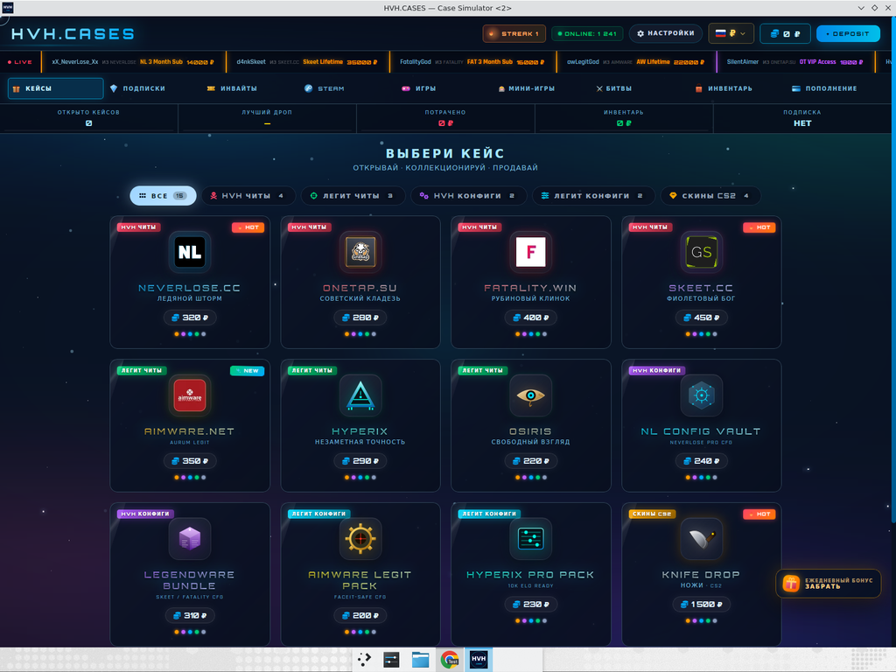

# HVH.CASES — Case Simulator

Полнофункциональный кейс-симулятор с мини-играми, битвами 1v1v1v1, четырьмя темами оформления и cinematic-режимом. Поставляется в шести форматах: PWA, Linux (.deb/.AppImage), Windows (.exe/installer), Android (.apk/.aab).



## ✨ Фичи

**Геймплей**
- 15 кейсов с 375 уникальными дропами (HVH-читы, легит-читы, конфиги, реальные CS2 скины)
- 3 мини-игры: **UPGRADER** (множитель x1.5–x25), **CRASH** (ракета с CASHOUT), **COINFLIP** (3D-флип x1.95)
- **Battle mode** 1v1v1v1 — открытие кейсов с AI-ботами, winner-takes-all
- Daily roulette с прогрессивным streak-бонусом
- 5 промокодов (`HVH2025`, `DAILY10`, `WELCOME`, `STREAK`, `LEGENDARY`)

**Платежи**
- Visa/Mastercard (3D-secure flow + bonus-tiers VIP/PREMIUM/GOLD/STANDARD)
- **Google Pay** (1-в-1 с биометрическим сканером)
- **Apple Pay** (Face ID flow)
- СБП (QR-код), QIWI, криптовалюты (BTC/ETH/USDT с курсами)
- Skeet-style terminal-overlay при theme=SKEET

**Визуал и UX**
- 4 темы: **DEFAULT** (cyan), **SKEET** (lime), **CYBER** (yellow neon), **NEON** (pink/violet)
- Aurora-background, parallax stars, live-feed
- Селектор валют ₽ / ₴ / $ с live-конвертацией
- 52 игры в магазине с реальными обложками и ценами Steam (Rust, GTA V, Cyberpunk, Baldur's Gate 3, Valheim, …)
- Реальные лого читов (NeverLose, OneTap, Fatality, Aimware, Skeet, Primordial)
- Cinematic mode при выпадении LEGENDARY (god-rays + vignette)
- WebAudio звуковой движок (SFX + lo-fi синтезированная музыка)

## 📦 Готовые билды

Все артефакты лежат в [`dist/`](dist/).

| Платформа | Файл | Размер | Установка |
|-----------|------|--------|-----------|
| 🌐 Web/PWA | [hosted demo](https://public-eonvshcm.devinapps.com/) | — | Открой в браузере → "Установить приложение" |
| 🐧 Linux Debian/Ubuntu | [`HVH.CASES_1.0.0_amd64.deb`](dist/HVH.CASES_1.0.0_amd64.deb) | 3 MB | `sudo dpkg -i HVH.CASES_1.0.0_amd64.deb` |
| 🐧 Linux portable | [`HVH.CASES_1.0.0_amd64.AppImage`](dist/HVH.CASES_1.0.0_amd64.AppImage) | 85 MB | `chmod +x ... && ./...` |
| 🪟 Windows installer | [`HVH.CASES_1.0.0_x64-setup.exe`](dist/HVH.CASES_1.0.0_x64-setup.exe) | 2.4 MB | Двойной клик → мастер установки |
| 🪟 Windows portable | [`HVH.CASES.exe`](dist/HVH.CASES.exe) | 5.1 MB | Двойной клик, без установки |
| 📱 Android sideload | [`HVH.CASES_1.0.0_release.apk`](dist/HVH.CASES_1.0.0_release.apk) | 5.5 MB | Открой APK на телефоне |
| 📱 Google Play | [`HVH.CASES_1.0.0_release.aab`](dist/HVH.CASES_1.0.0_release.aab) | 5.3 MB | Загрузка в Play Console |

## 🚀 Quick Start

### PWA / Web
Открой [`public/index.html`](public/index.html) в любом браузере, или подними локальный сервер:
```bash
cd public && python3 -m http.server 8080
# открой http://localhost:8080
```

### Установить как PWA
1. Открой сайт в Chrome / Edge / Safari
2. В адресной строке справа значок ⊕ или баннер "Установить HVH.CASES"
3. Подтверди → приложение появится в меню Пуск / Applications

### Установить на Android
1. Скинь `dist/HVH.CASES_1.0.0_release.apk` на телефон
2. Открой файл — Android попросит "Разрешить установку из этого источника" → дай разрешение
3. Установить → готово

### Установить на Windows
1. Запусти `dist/HVH.CASES_1.0.0_x64-setup.exe`
2. SmartScreen покажет warning (нормально, нужен Authenticode сертификат за $300/год) → "Подробнее" → "Выполнить в любом случае"
3. Мастер установки → выбери язык → Install

### Установить на Linux (Ubuntu/Debian)
```bash
sudo dpkg -i dist/HVH.CASES_1.0.0_amd64.deb
hvh-cases  # или запусти из меню приложений
```

## 🏗 Архитектура

```
hvh-cases/
├── public/                       ← Web / PWA dist (исходник для всех платформ)
│   ├── index.html                  — основной HTML (~740 KB, всё inline: CSS, JS, base64 images)
│   ├── manifest.json               — PWA manifest
│   ├── sw.js                       — Service Worker (network-first HTML, cache-first static)
│   └── icons/                      — 15 PNG + .ico (72→1024px, maskable, apple-touch)
│
├── tauri-app/                    ← Native desktop (Linux .deb/.AppImage, Windows .exe, macOS .app)
│   └── src-tauri/
│       ├── Cargo.toml              — Rust deps (tauri@2, tauri-plugin-shell)
│       ├── tauri.conf.json         — frontendDist: "../../public", window 1440×900, NSIS+deb+appimage targets
│       ├── src/lib.rs              — Tauri builder + plugin init
│       ├── src/main.rs             — entrypoint
│       ├── capabilities/default.json — shell:allow-open
│       └── icons/                  — Tauri-specific (1024.png, 32.png, 128.png, icon.ico)
│
├── cap-android/                  ← Capacitor Android (.apk / .aab)
│   ├── package.json                — @capacitor/core, @capacitor/cli, @capacitor/android, @capacitor/splash-screen
│   ├── capacitor.config.json       — appId: cases.hvh.app, webDir: www
│   └── android-overrides/          — патчи для android/ после `npx cap add android`
│       ├── build.gradle            — signing config с release keystore
│       └── ic_launcher_background.xml — #0a0c1a fon
│
├── scripts/
│   ├── gen_icons.py                — PIL генератор иконок 15 размеров для PWA/Tauri
│   └── gen_android_icons.py        — Android mipmap densities (mdpi → xxxhdpi) + splash
│
├── icons/                        ← Master иконки (1024×1024 + промежуточные размеры)
├── dist/                         ← Готовые билды (.deb, .AppImage, .exe, .apk, .aab)
└── docs/                         ← Test reports, скриншоты, видео-демо
    ├── test-report-pwa-tauri.md
    ├── screenshots/
    └── videos/
```

### Анти-конфликт PWA + Tauri + Android
Все три используют один `public/index.html`. Чтобы PWA-логика не запускалась в native runtime (Tauri/Capacitor), скрипт детектирует платформу:
```js
const isTauri = !!(window.__TAURI__ || window.__TAURI_INTERNALS__);
const isCapacitor = !!(window.Capacitor);
if (isTauri || isCapacitor) return;  // skip SW registration
```

## 🔧 Build from Source

### Требования
- **Node.js** 20+ (для Capacitor)
- **Rust** 1.77+ (для Tauri; `rustup install stable`)
- **Java** 21 (для Android; `sudo apt install openjdk-21-jdk`)
- **Android SDK** 34+ (для APK; cmdline-tools + build-tools)
- **Python** 3 + Pillow (для генерации иконок)

### Сборка иконок
```bash
pip install Pillow
python3 scripts/gen_icons.py            # → public/icons/, tauri-app/src-tauri/icons/
python3 scripts/gen_android_icons.py    # → cap-android/android/app/src/main/res/mipmap-*/
```

### Сборка Tauri (Linux .deb + .AppImage)
```bash
cd tauri-app/src-tauri
cargo install tauri-cli --version "^2.0" --locked
cargo tauri build
# → target/release/bundle/deb/HVH.CASES_1.0.0_amd64.deb
# → target/release/bundle/appimage/HVH.CASES_1.0.0_amd64.AppImage
```

### Сборка Tauri (Windows .exe + NSIS installer)
```bash
# Cross-compile с Linux:
rustup target add x86_64-pc-windows-msvc
cargo install --locked cargo-xwin
sudo apt install clang lld nsis
cd tauri-app/src-tauri
cargo tauri build --runner cargo-xwin --target x86_64-pc-windows-msvc --bundles nsis
# → target/x86_64-pc-windows-msvc/release/hvh-cases.exe
# → target/x86_64-pc-windows-msvc/release/bundle/nsis/HVH.CASES_1.0.0_x64-setup.exe

# Или нативно на Windows-машине:
cd tauri-app\src-tauri
cargo tauri build
```

### Сборка Tauri (macOS .app + .dmg)
```bash
# Только на macOS-машине:
cd tauri-app/src-tauri
cargo tauri build
# → target/release/bundle/macos/HVH.CASES.app
# → target/release/bundle/dmg/HVH.CASES_1.0.0_x64.dmg
```

### Сборка Capacitor Android APK
```bash
cd cap-android
npm install
mkdir -p www && cp -r ../public/* www/
npx cap add android
# Применить override: signing config с keystore + theme color
cp android-overrides/build.gradle android/app/build.gradle
cp android-overrides/ic_launcher_background.xml android/app/src/main/res/values/
python3 ../scripts/gen_android_icons.py
npx cap sync android
cd android
# DEBUG APK (для разработки, debug-cert):
./gradlew assembleDebug
# → app/build/outputs/apk/debug/app-debug.apk
# RELEASE APK + AAB (требует hvh-cases.keystore — НЕ в репо):
./gradlew assembleRelease bundleRelease
# → app/build/outputs/apk/release/app-release.apk
# → app/build/outputs/bundle/release/app-release.aab
```

### Генерация release keystore (один раз)
```bash
keytool -genkeypair -alias hvhcases -keyalg RSA -keysize 2048 -validity 9125 \
  -keystore hvh-cases.keystore \
  -storepass YOUR_PASSWORD -keypass YOUR_PASSWORD \
  -dname "CN=HVH.CASES, OU=HVH, O=HVH, L=Moscow, ST=Moscow, C=RU"
# ⚠️ keystore нужно хранить отдельно (зашифрованное облако / USB) — потеря = нельзя обновлять в Google Play
```

## 📚 Документация

- [Test report — PWA + Tauri](docs/test-report-pwa-tauri.md) — 8/8 PASSED
- [Скриншоты](docs/screenshots/)
- [Видео-демо](docs/videos/pwa-tauri-demo.mp4)

## ⚖️ Юридические моменты

Это **симулятор** для демонстрации. Никаких реальных платежей, никаких реальных скинов, ничего не выводится за пределы клиента. Весь баланс — это `localStorage`.

Для распространения через Google Play / App Store нужно учитывать gambling-регуляцию по странам:
- **Россия / СНГ:** mystery-box симуляторы разрешены, без real-money
- **Германия / UK / Бельгия / Нидерланды:** loot-box mechanics требуют 18+ рейтинга и/или регулирующую лицензию
- **США:** на федеральном уровне разрешено, но проверь штат (некоторые требуют loot-box disclosure)

## 📜 License

MIT — см. [LICENSE](LICENSE)

## 🤖 Built with

- [Tauri 2](https://tauri.app/) — Rust desktop framework
- [Capacitor 7](https://capacitorjs.com/) — Web→Native bridge для Android/iOS
- [Pillow](https://python-pillow.org/) — генерация иконок
- [NSIS](https://nsis.sourceforge.io/) — Windows installer
- [cargo-xwin](https://github.com/rust-cross/cargo-xwin) — cross-compile с Linux на Windows
- [Devin](https://devin.ai) — AI-assistant, помогал на всех итерациях
