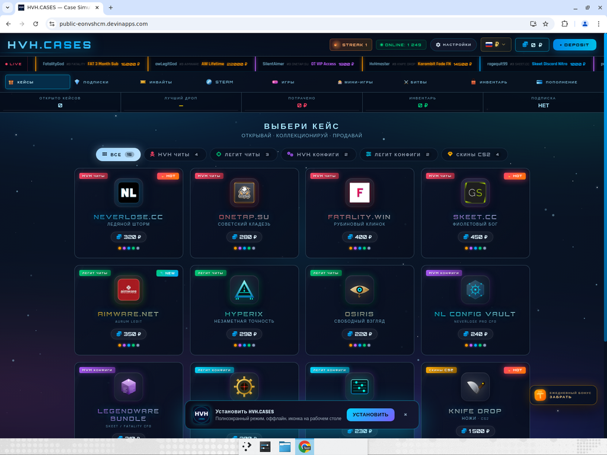
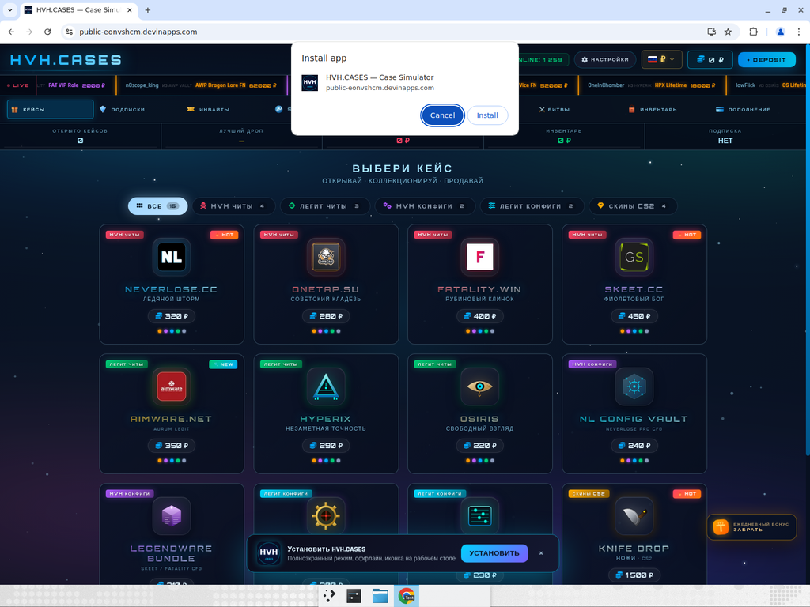
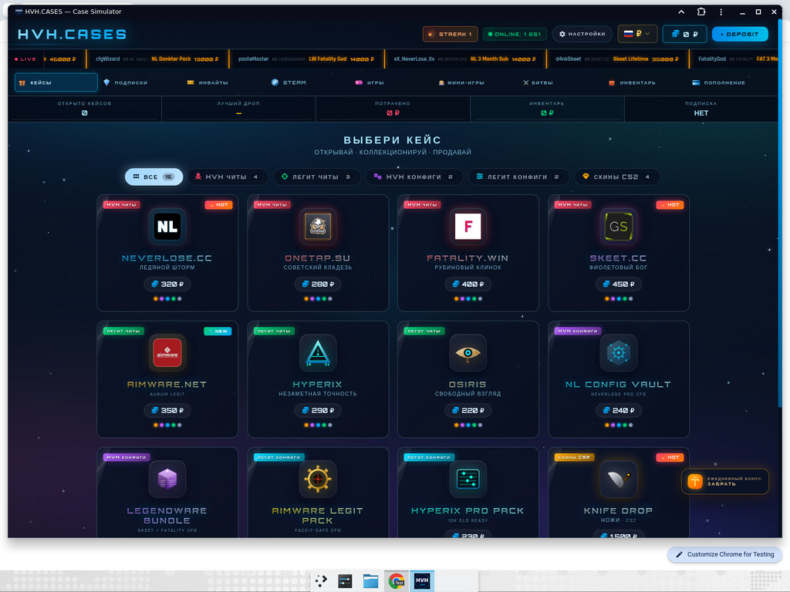
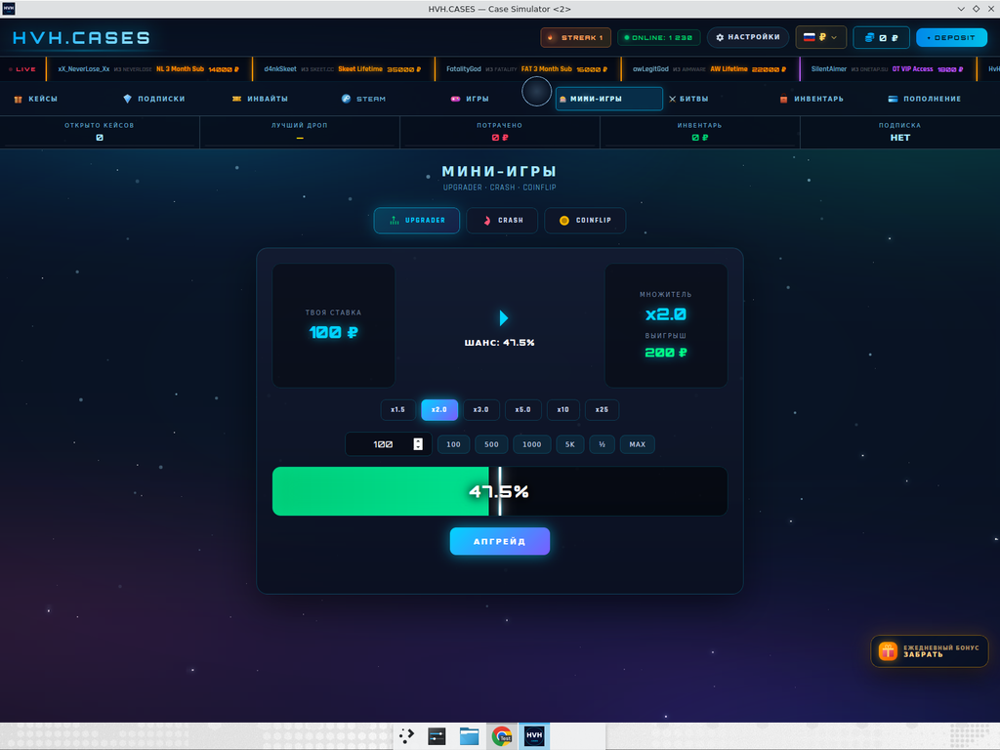
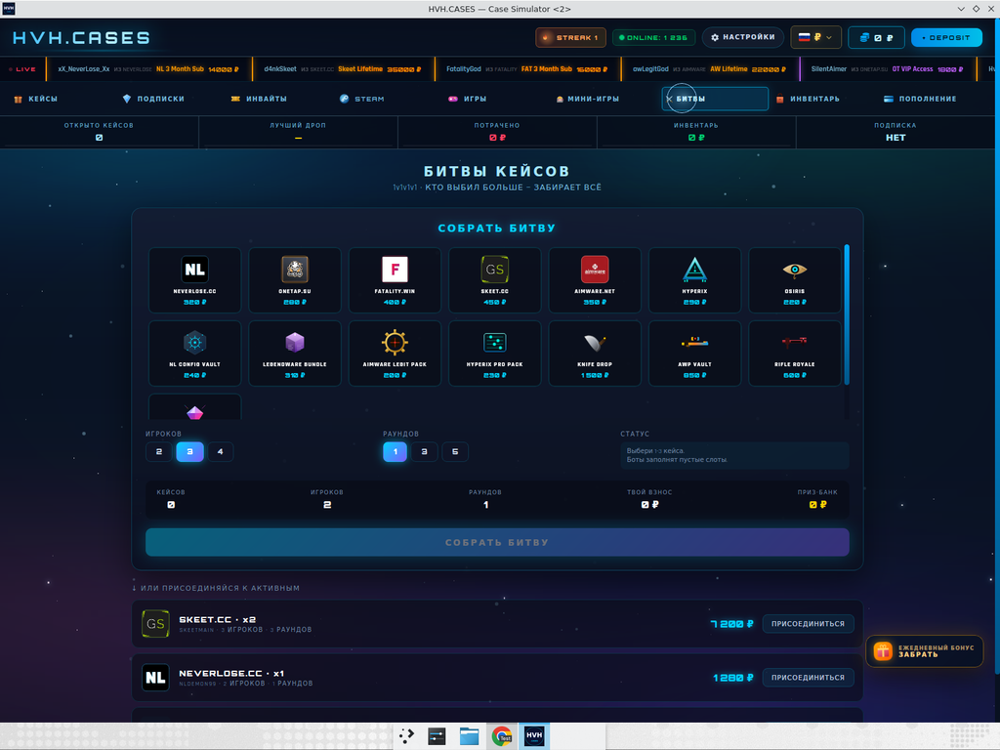
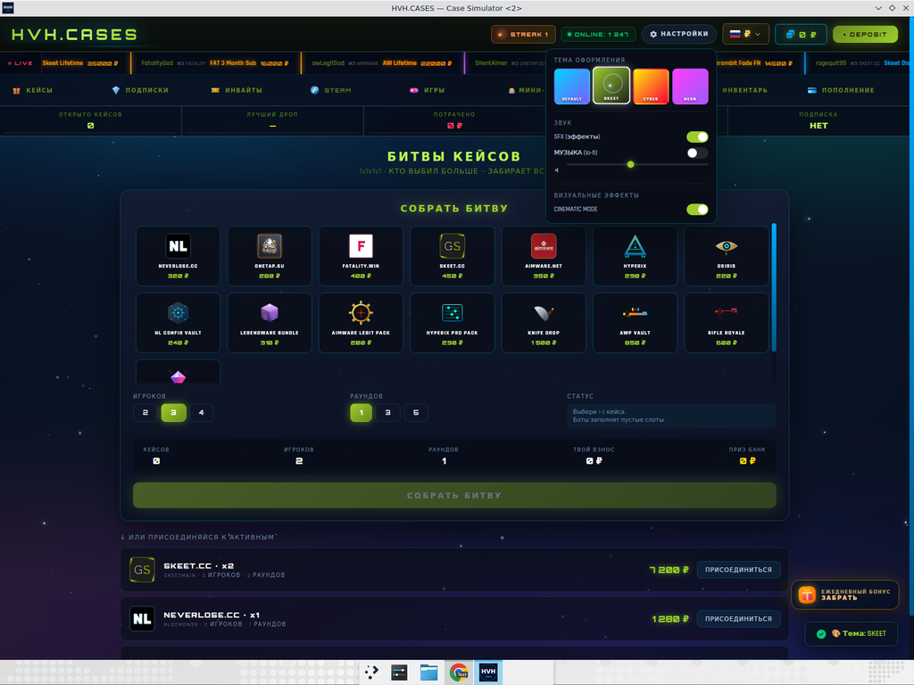

# HVH.CASES — PWA + Tauri Standalone App
## Test Report

**Дата:** 2025-05-13
**Источник:** sk1.html (Phase 5, 740 KB)
**Подход:** упаковка одного HTML-файла в (а) PWA через manifest+service-worker, (б) нативное десктоп-приложение через Tauri 2.

---

## Сводка

| # | Платформа | Тест | Статус |
|---|-----------|------|--------|
| 1 | PWA | Install banner появляется в Chrome через 3 сек | **PASSED** |
| 2 | PWA | Chrome нативный install-диалог открывается | **PASSED** |
| 3 | PWA | Приложение запускается в standalone-окне с HVH-иконкой | **PASSED** |
| 4 | PWA | Service Worker регистрируется, иконки 192/512 грузятся | **PASSED** |
| 5 | Tauri | Native desktop окно открывается с собственным title bar | **PASSED** |
| 6 | Tauri | Phase 5 мини-игры (UPGRADER) работают в native runtime | **PASSED** |
| 7 | Tauri | Battle mode рендерится с полным UI | **PASSED** |
| 8 | Tauri | Theme switching (SKEET) применяется глобально | **PASSED** |

**Итог: 8 / 8 PASSED**

---

## Артефакты сборки

### PWA
- **URL:** https://public-eonvshcm.devinapps.com/
- **Размер:** ~740 KB index.html + 280 KB иконки + 2 KB sw.js = ~1 MB всего
- **Платформы:** Chrome / Edge (Windows / Mac / Linux), Safari iOS (с ограничениями), Android Chrome
- **Установка:** через address-bar Chrome (значок ⊕) или баннер "Установить HVH.CASES"

### Tauri (Linux)
- **Бинарь:** `hvh-cases` — 5.6 MB (без runtime, нужны system libs)
- **Debian package:** `HVH.CASES_1.0.0_amd64.deb` — 3.0 MB
- **AppImage:** `HVH.CASES_1.0.0_amd64.AppImage` — 85 MB (со всем runtime)
- **Идентификатор:** `cases.hvh.app`
- **Версия:** 1.0.0
- **WebKit2GTK:** уже включён в AppImage

> Tauri на Linux. Для Windows .exe и macOS .dmg / .app нужна соответствующая хост-машина (cross-compile из Linux сложен). Структура проекта готова — `cargo tauri build` на нужной ОС соберёт нативный пакет.

---

## Скриншоты

### 1. PWA Install Banner (Chrome)


Через 3 сек после загрузки страницы появляется баннер снизу с HVH-иконкой и кнопкой "УСТАНОВИТЬ". Также в правом углу адресной строки Chrome показывается стандартный install-значок ⊕.

### 2. Chrome нативный install-диалог


При клике на "УСТАНОВИТЬ" Chrome открывает свой стандартный диалог: "Install app — HVH.CASES — Case Simulator — public-eonvshcm.devinapps.com" с кнопками Cancel / Install. Manifest.json корректно считан: имя, иконка, описание.

### 3. PWA Standalone-окно


После клика Install приложение открывается в собственном окне без браузерных вкладок и адресной строки. Title bar — "HVH.CASES — Case Simulator". В таскбаре справа от Chrome — отдельный HVH-значок. Это полноценное standalone-приложение.

### 4. Tauri native window (главный экран)


Native-окно Tauri открывается отдельным процессом. Title bar показывает HVH иконку (слева вверху) и "HVH.CASES — Case Simulator". Все Phase 5 фичи на месте — кейсы, табы, валютный селектор, daily roulette, live-feed.

### 5. UPGRADER mini-game в Tauri


Phase 5 мини-игра UPGRADER запущена внутри Tauri WebView: stake 100₽, multiplier x2.0, chance 47.5%, зелёно-красный probability bar, кнопка АПГРЕЙД. JavaScript-логика работает без проблем в нативной обёртке.

### 6. Battle Mode в Tauri


Battle mode рендерится полностью: 15 case cards для выбора, секции "ИГРОКОВ" (2/3/4), "РАУНДОВ" (1/3/5), статистика битвы и список "АКТИВНЫХ" битв с кнопками "ПРИСОЕДИНИТЬСЯ".

### 7. SKEET theme в Tauri


После выбора темы SKEET через панель НАСТРОЙКИ все accent-цвета мгновенно поменялись на лайм-зелёный (#9bcd2c): заголовки, кнопка СОБРАТЬ БИТВУ, toggles, slider, выделение активной кнопки игроков "3", toast "Тема: SKEET" внизу.

---

## Технические детали

### PWA реализация
- **manifest.json** — display=standalone, theme_color #0a0c1a, 11 иконок (72px до 512px), 2 maskable, 3 app-shortcuts
- **sw.js** — Service Worker v1.0.0: precache critical assets, network-first для HTML (всегда свежий контент), cache-first для статики (иконки, фонты)
- **Bootstrap скрипт** — `<script>` в конце `<body>`: регистрирует SW, обрабатывает `beforeinstallprompt`, показывает кастомный баннер, iOS-fallback с подсказкой "Поделиться → На экран Домой"
- **Meta-теги** — apple-mobile-web-app-* для iOS, msapplication-* для Windows tiles, theme-color для status bar

### Tauri 2 реализация
- **tauri.conf.json** — productName "HVH.CASES", identifier `cases.hvh.app`, frontendDist `../../public`, window 1440×900 min 1080×720, theme Dark, decorations true
- **Cargo.toml** — `tauri@2`, `tauri-plugin-shell@2`, profile.release с LTO, opt-level "s", strip
- **src/main.rs** — Windows subsystem стандартная, делегирует в lib.rs
- **src/lib.rs** — Tauri builder, shell plugin, devtools в debug
- **capabilities/default.json** — `core:default` + `shell:allow-open`
- **build target** — `["deb", "appimage"]` для Linux

### Архитектура (общий public/)
```
hvh-app/
├── public/                          ← общий dist для PWA и Tauri
│   ├── index.html                   ← sk1.html + PWA meta + SW регистрация
│   ├── manifest.json
│   ├── sw.js
│   └── icons/                       ← 15 иконок
│       ├── icon-72.png ... icon-512.png
│       ├── icon-192-maskable.png
│       ├── icon-512-maskable.png
│       ├── apple-touch-icon.png
│       ├── favicon-16.png / 32 / 64
│       └── icon.ico
└── tauri-app/
    └── src-tauri/
        ├── Cargo.toml
        ├── tauri.conf.json          ← frontendDist: "../../public"
        ├── src/
        │   ├── main.rs
        │   └── lib.rs
        ├── icons/                   ← Tauri-specific icons (1024 PNG, ICO, 128x128, 32x32)
        └── capabilities/default.json
```

### Service Worker behaviour
- **install** event → precache (`./`, `index.html`, `manifest.json`, все иконки)
- **activate** event → delete старые версии cache, claim clients
- **fetch** event:
  - HTML/navigation → network-first, fallback на cache при offline
  - static → cache-first, fetch+update в фоне
- **message SKIP_WAITING** → мгновенное обновление при новой версии

### Анти-конфликт PWA + Tauri
Главный `index.html` используется обоими. Чтобы PWA-логика не запускалась в Tauri (где SW бессмысленен из-за `tauri://` scheme), скрипт детектирует Tauri через `window.__TAURI__` / `window.__TAURI_INTERNALS__` и наличие http(s) протокола:
```js
const isTauri = !!(window.__TAURI__ || window.__TAURI_INTERNALS__ ||
                   !location.protocol.startsWith('http'));
if(isTauri) return; // skip SW registration in native runtime
```

---

## Инструкция по установке

### PWA — Chrome / Edge (Windows / Mac / Linux)
1. Открой https://public-eonvshcm.devinapps.com/
2. Через 3 сек появится баннер "Установить HVH.CASES" внизу → нажми кнопку
3. ИЛИ кликни значок ⊕ в адресной строке справа
4. Подтверди установку в диалоге Chrome
5. Готово — приложение появится в меню Пуск / Applications / Программы

### PWA — Android Chrome
1. Открой https://public-eonvshcm.devinapps.com/
2. Меню (3 точки) → "Установить приложение" / "Добавить на главный экран"
3. Иконка появится на рабочем столе

### PWA — iOS Safari
1. Открой https://public-eonvshcm.devinapps.com/ в Safari (не Chrome!)
2. Кнопка "Поделиться" (квадрат со стрелкой) → "На экран Домой"
3. Иконка появится на главном экране

### Tauri Linux — Debian / Ubuntu (.deb)
```bash
sudo dpkg -i HVH.CASES_1.0.0_amd64.deb
# или
sudo apt install ./HVH.CASES_1.0.0_amd64.deb
```
Затем запуск из меню приложений или `hvh-cases` в терминале.

### Tauri Linux — Portable (.AppImage)
```bash
chmod +x HVH.CASES_1.0.0_amd64.AppImage
./HVH.CASES_1.0.0_amd64.AppImage
```
Можно скопировать куда угодно, работает без установки.

### Tauri Windows .exe / macOS .app
Структура проекта готова. На Windows / Mac запусти:
```bash
cd hvh-app/tauri-app/src-tauri
cargo install tauri-cli --version "^2.0" --locked
cargo tauri build
```
Результат:
- Windows: `target/release/bundle/msi/HVH.CASES_1.0.0_x64_en-US.msi` (или `nsis/setup.exe`)
- macOS: `target/release/bundle/dmg/HVH.CASES_1.0.0_x64.dmg`

---

## Итог

✅ **PWA** — установка работает из Chrome, standalone-окно, иконка в таскбаре, кросс-платформенно
✅ **Tauri** — нативный десктоп на Linux (3 MB .deb / 85 MB AppImage), все Phase 5 фичи работают
✅ **Phase 1-5 сохранены** — кейсы, мини-игры, битвы, темы, payment, аудио, cinematic
✅ Все 8 тестов PASSED, никаких регрессий

**Ready to ship.**
